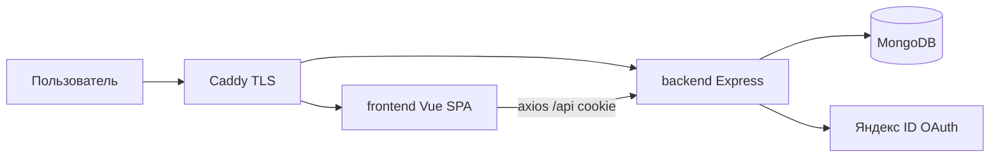
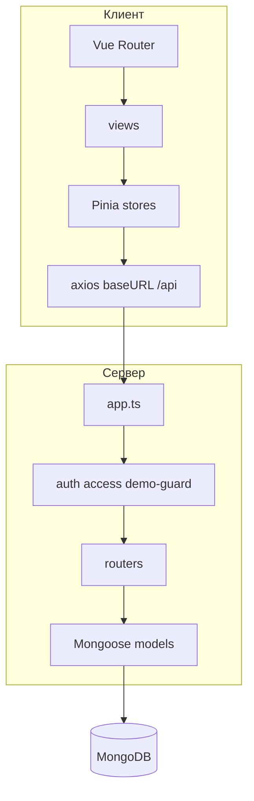
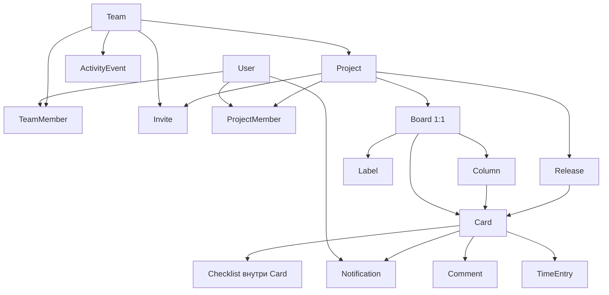
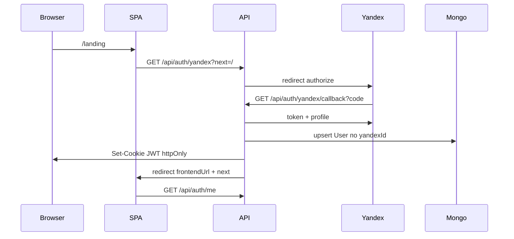

# Техническая карта Taskmaster

Продуктовый чеклист — в [корневом README](../README.md). Здесь — схема системы: сущности, поля, экраны и API.

**Стек:** Vue 3 + TypeScript, Pinia, axios / Express + Mongoose / MongoDB.

## Содержание

- [Архитектура](#архитектура)
- [Иерархия домена](#иерархия-домена)
- [Авторизация](#авторизация)
- [Роли](#роли)
- [Экономика](#экономика)
- [Исходники](#исходники)
- [data-model.md](data-model.md) — ER-диаграмма и поля коллекций
- [frontend.md](frontend.md) — маршруты SPA и экраны
- [api.md](api.md) — REST API

## Архитектура

Браузер ходит на один домен. Caddy отдаёт SPA и проксирует `/api` на Express. JWT живёт в httpOnly cookie, TTL 7 дней, без refresh.

Контейнеры Compose: `frontend`, `backend`, `mongodb` (наружу не открыт). Прод: [taskmaster.shamilfrontend.ru](https://taskmaster.shamilfrontend.ru).

## Иерархия домена

Команда — рабочее пространство. Проект принадлежит команде и имеет одну канбан-доску (в UI доска не показывается отдельно). Карточка живёт в колонке доски; релиз, списания и комментарии висят на карточке.

Пользователь может быть в нескольких командах. Состав и роль на проекте задаются отдельно от командной роли. Owner команды видит все проекты команды.

## Авторизация

Локального логина/пароля нет. Аккаунт создаётся или обновляется при входе через Яндекс ID.

Демо-вход: `POST /api/auth/demo` создаёт пользователя с `yandexId = demo` и сидирует команду «Наша команда». Записи в демо блокируются (`blockDemoWrites` + клиентский interceptor), кроме logout и повторного demo.

## Роли

Два независимых слоя: **команда** и **проект**. Значения одинаковые: `owner | admin | member | viewer`.

| Слой | Кто задаёт | Зачем |
| --- | --- | --- |
| Команда | инвайт или создатель | инвайты, состав команды, создание проекта, удаление команды |
| Проект | Owner/Admin проекта или Owner команды | карточки, колонки, релизы, аналитика |

Owner через инвайт и смену роли не выдаётся. Создатель команды/проекта становится Owner.

## Часы

- **План карточки** = `estimateHours`
- **Факт** = сумма `TimeEntry.hours` по списаниям карточки
- Списание пишет `hours` и `workedAt`; ставка и суммы не хранятся

## Исходники

| Что | Где |
| --- | --- |
| Модели | [`server/src/models/`](../server/src/models/) |
| REST-роутеры | [`server/src/routes/`](../server/src/routes/), монтирование в [`server/src/app.ts`](../server/src/app.ts) |
| Vue-маршруты | [`client/src/router/index.ts`](../client/src/router/index.ts) |
| Типы клиента | [`client/src/types/index.ts`](../client/src/types/index.ts) |
| Константы ролей и колонок | [`server/src/constants.ts`](../server/src/constants.ts) |
