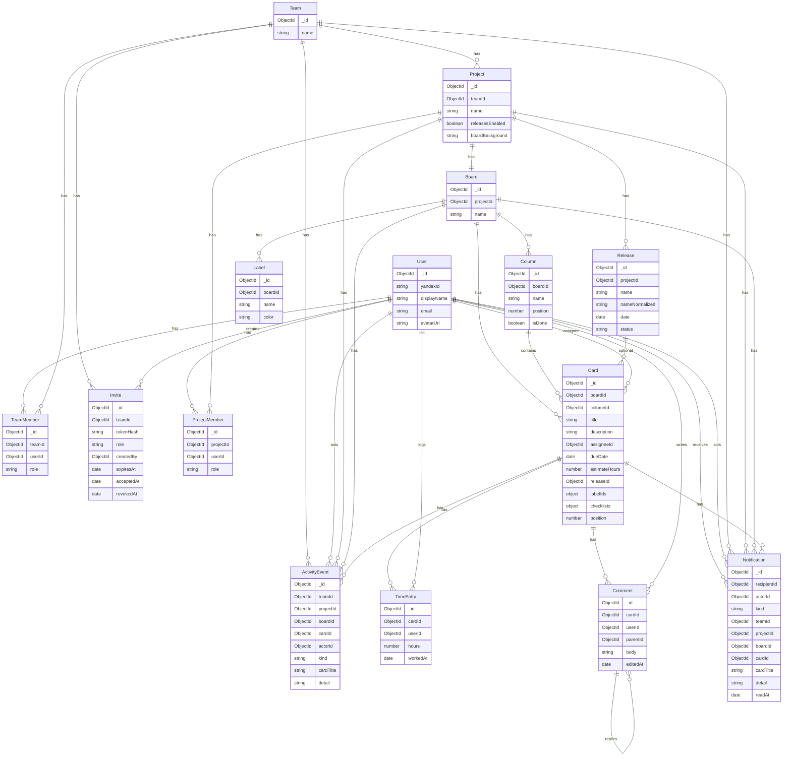

# Модель данных

Коллекции MongoDB (Mongoose). У всех схем, кроме `ActivityEvent`, есть `createdAt` и `updatedAt` (`timestamps: true`). `ActivityEvent` пишет только `createdAt`.

Источник: [`server/src/models/`](../server/src/models/).

## ER-диаграмма

Чеклисты не отдельная коллекция: вложены в `Card.checklists`.

## Формулы

| Величина | Формула |
| --- | --- |
| План карточки | `estimateHours` |
| Факт карточки | сумма `TimeEntry.hours` по списаниям карточки |

## User

Аккаунт Яндекс ID. Демо-пользователь: `yandexId = "demo"`.

| Поле | Тип | Зачем |
| --- | --- | --- |
| `_id` | ObjectId | PK |
| `yandexId` | string, unique | Идентификатор Яндекса; upsert при OAuth |
| `displayName` | string | Имя в UI и ленте действий |
| `email` | string, default `""` | Из профиля Яндекса, может быть пустым |
| `avatarUrl` | string, default `""` | Аватар `avatars.yandex.net/.../islands-200` |
| `createdAt` / `updatedAt` | Date | Служебные |

## Team

Рабочее пространство: участники, инвайты, проекты.

| Поле | Тип | Зачем |
| --- | --- | --- |
| `_id` | ObjectId | PK |
| `name` | string | Название команды |
| `createdAt` / `updatedAt` | Date | Служебные |

## TeamMember

Связь пользователь ↔ команда. Unique `(teamId, userId)`.

| Поле | Тип | Зачем |
| --- | --- | --- |
| `_id` | ObjectId | PK |
| `teamId` | ObjectId → Team | Команда |
| `userId` | ObjectId → User | Участник |
| `role` | `owner \| admin \| member \| viewer` | Права на уровне команды |
| `createdAt` / `updatedAt` | Date | Служебные |

Owner один по смыслу продукта: роль Owner через смену роли не назначается, Owner не может выйти.

## Invite

Одноразовая ссылка `/invite/:token`. Сырой токен не хранится, только SHA-хеш. Срок 7 дней. Роль в инвайте: `admin | member | viewer` (без owner).

| Поле | Тип | Зачем |
| --- | --- | --- |
| `_id` | ObjectId | PK |
| `teamId` | ObjectId → Team | Куда приглашают |
| `tokenHash` | string, unique | Хеш токена из URL |
| `role` | InviteRole | Роль, которую получит вступивший |
| `createdBy` | ObjectId → User | Кто создал ссылку |
| `expiresAt` | Date | Истечение (создание + 7 дней) |
| `acceptedAt` | Date \| null | Когда приняли; после этого ссылка мертва |
| `revokedAt` | Date \| null | Отзыв Owner/Admin до принятия |
| `createdAt` / `updatedAt` | Date | Служебные |

Уже состоящий в команде при accept не вступает повторно, ссылка всё равно сгорает.

## Project

Принадлежит команде. Одна доска создаётся сразу. Релизы — опциональный флаг.

| Поле | Тип | Зачем |
| --- | --- | --- |
| `_id` | ObjectId | PK |
| `teamId` | ObjectId → Team | Родительская команда |
| `name` | string | Название проекта |
| `releasesEnabled` | boolean, default false | Вкладка релизов и поле релиза на карточке |
| `boardBackground` | `default \| bg-01…bg-36` | Фон канбана |
| `createdAt` / `updatedAt` | Date | Служебные |

Индекс: `{ teamId: 1 }`.

## ProjectMember

Состав проекта. Unique `(projectId, userId)`. Роль независима от командной.

| Поле | Тип | Зачем |
| --- | --- | --- |
| `_id` | ObjectId | PK |
| `projectId` | ObjectId → Project | Проект |
| `userId` | ObjectId → User | Участник (должен быть в команде проекта) |
| `role` | `owner \| admin \| member \| viewer` | Права на проекте |
| `createdAt` / `updatedAt` | Date | Служебные |

Добавить можно только участника этой команды, роли Admin / Member / Viewer. Owner проекта нельзя исключить и нельзя выйти.

## Board

Техническая сущность 1:1 с проектом. В UI не показывается; URL `/boards/:id` редиректит на проект. Имя по умолчанию: «Основная».

| Поле | Тип | Зачем |
| --- | --- | --- |
| `_id` | ObjectId | PK |
| `projectId` | ObjectId → Project | Проект (индекс) |
| `name` | string | Служебное имя доски |
| `createdAt` / `updatedAt` | Date | Служебные |

При создании проекта сразу четыре колонки: «К выполнению», «В работе», «На проверке», «Готово» (`isDone` только у последней).

## Column

Колонка канбана. Порядок — `position`. Удаление запрещено, если в колонке есть карточки.

| Поле | Тип | Зачем |
| --- | --- | --- |
| `_id` | ObjectId | PK |
| `boardId` | ObjectId → Board | Доска |
| `name` | string | Заголовок колонки |
| `position` | number | Порядок слева направо |
| `isDone` | boolean, default false | «Готово» для просрочки и аналитики; не сравниваем по имени |
| `createdAt` / `updatedAt` | Date | Служебные |

Индекс: `{ boardId: 1, position: 1 }`. Новая колонка всегда `isDone: false`.

## Label

Метка принадлежит доске, не карточке. На карточке — массив `labelIds`.

| Поле | Тип | Зачем |
| --- | --- | --- |
| `_id` | ObjectId | PK |
| `boardId` | ObjectId → Board | Доска |
| `name` | string | Подпись метки |
| `color` | `blue \| green \| purple \| pink \| amber` | Цвет в UI |
| `createdAt` / `updatedAt` | Date | Служебные |

Создать, переименовать, удалить — Owner/Admin. Назначить на карточку — Member+. При удалении метка снимается со всех карточек.

## Release

Версия проекта. Название уникально в проекте (trim, без учёта регистра → `nameNormalized`).

| Поле | Тип | Зачем |
| --- | --- | --- |
| `_id` | ObjectId | PK |
| `projectId` | ObjectId → Project | Проект |
| `name` | string | Отображаемое имя |
| `nameNormalized` | string | Ключ уникальности |
| `date` | Date \| null | Плановая дата, можно пустую |
| `status` | `planned \| released` | Информационный статус; create всегда `planned` |
| `createdAt` / `updatedAt` | Date | Служебные |

Unique: `{ projectId: 1, nameNormalized: 1 }`. К `released` можно прикреплять карточки (хотфиксы). Смена статуса не двигает карточки. Удаление сбрасывает `Card.releaseId` в `null`.

## Card

Задача на доске. Чеклисты — вложенный массив, не отдельная коллекция.

| Поле | Тип | Зачем |
| --- | --- | --- |
| `_id` | ObjectId | PK |
| `boardId` | ObjectId → Board | Доска проекта |
| `columnId` | ObjectId → Column | Текущая колонка (только этой доски) |
| `title` | string | Заголовок |
| `description` | string, default `""` | Описание, max 8000 |
| `assigneeId` | ObjectId → User \| null | Один исполнитель из состава проекта |
| `dueDate` | Date \| null | Срок; просрочка = дата < сегодня и колонка без `isDone` |
| `estimateHours` | number, default 0 | Оценка часов: 0…1000, шаг 0.5 |
| `releaseId` | ObjectId → Release \| null | Один релиз или без релиза |
| `labelIds` | ObjectId[] → Label | Метки этой доски |
| `checklists` | Checklist[] | Чеклисты (см. ниже) |
| `position` | number | Порядок в колонке |
| `createdAt` / `updatedAt` | Date | Служебные |

Индексы: `{ boardId, columnId, position }`, `{ releaseId }`, `{ assigneeId }`.

Без списаний карточку удаляет Member+; со списаниями — только Owner/Admin.

### Checklist (вложен в Card)

| Поле | Тип | Зачем |
| --- | --- | --- |
| `_id` | ObjectId | PK чеклиста |
| `title` | string | Название, default «Чеклист», max 200 |
| `position` | number | Порядок чеклистов |
| `items` | ChecklistItem[] | Пункты |

### ChecklistItem

| Поле | Тип | Зачем |
| --- | --- | --- |
| `_id` | ObjectId | PK пункта |
| `text` | string | Текст, max 500 |
| `done` | boolean | Выполнен |
| `position` | number | Порядок в чеклисте |

## TimeEntry

Списание часов. Списывает всегда текущий пользователь.

| Поле | Тип | Зачем |
| --- | --- | --- |
| `_id` | ObjectId | PK |
| `cardId` | ObjectId → Card | Карточка |
| `userId` | ObjectId → User | Кто списал (не обязательно исполнитель) |
| `hours` | number | 0.5…24, шаг 0.5 |
| `workedAt` | Date | Дата работы; фильтр аналитики по периоду |
| `createdAt` / `updatedAt` | Date | Служебные |

Индексы: `{ cardId }`, `{ userId, workedAt }`. Member правит/удаляет только свои записи и только если он текущий исполнитель. Owner/Admin — любые.

## Comment

Комментарий карточки. Один уровень ответов: `parentId` указывает на корневой комментарий. Удаление корня удаляет ответы. Max тела 2000.

| Поле | Тип | Зачем |
| --- | --- | --- |
| `_id` | ObjectId | PK |
| `cardId` | ObjectId → Card | Карточка |
| `userId` | ObjectId → User | Автор |
| `parentId` | ObjectId → Comment \| null | Корень треда; у ответа всегда корень, не другой ответ |
| `body` | string | Текст |
| `editedAt` | Date \| null | Метка «изменён»; история версий не хранится |
| `createdAt` / `updatedAt` | Date | Служебные |

Индекс: `{ cardId: 1, createdAt: 1 }`. Правит только автор. Удаляет автор либо Owner/Admin. Viewer не комментирует.

## ActivityEvent

Лента «Действия» команды. Комментарии в ленте читаются из `Comment` на лету; в коллекцию пишутся `card_created` и `card_moved` (и `comment_added` тоже пишется при создании комментария).

| Поле | Тип | Зачем |
| --- | --- | --- |
| `_id` | ObjectId | PK |
| `teamId` | ObjectId → Team | Команда для ленты |
| `projectId` | ObjectId → Project | Проект (фильтр по доступным) |
| `boardId` | ObjectId → Board | Доска |
| `cardId` | ObjectId → Card | Карточка |
| `actorId` | ObjectId → User | Кто сделал |
| `kind` | `card_created \| card_moved \| comment_added` | Тип события |
| `cardTitle` | string | Снимок названия |
| `detail` | string | Колонка / превью комментария, max ~120 |
| `createdAt` | Date | Только создание, без `updatedAt` |

Индексы: `{ teamId, createdAt: -1 }`, `{ boardId }`.

## Notification

Личный инбокс. Автор действия не получает запись о себе. `readAt = null` — непрочитано.

| Поле | Тип | Зачем |
| --- | --- | --- |
| `_id` | ObjectId | PK |
| `recipientId` | ObjectId → User | Кому |
| `actorId` | ObjectId → User \| null | Кто сделал; пусто у срока |
| `kind` | `card_assigned \| comment_added \| comment_reply \| card_overdue \| card_due_soon` | Тип |
| `teamId` | ObjectId → Team | Команда |
| `projectId` | ObjectId → Project | Проект |
| `boardId` | ObjectId → Board | Доска |
| `cardId` | ObjectId → Card | Карточка |
| `cardTitle` | string | Снимок названия |
| `detail` | string | Превью комментария или дата срока, max ~120 |
| `readAt` | Date \| null | Когда прочитали |
| `createdAt` / `updatedAt` | Date | Служебные |

Индексы: `{ recipientId, createdAt: -1 }`, `{ recipientId, readAt }`, `{ recipientId, kind, cardId, createdAt }`, `{ cardId }`. Каскад при удалении карточки / доски / проекта / команды.
