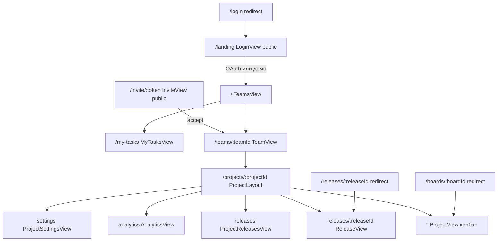

# Фронтенд: маршруты и экраны

SPA на Vue 3. История HTML5 (`createWebHistory`). Axios: `baseURL: '/api'`, `withCredentials: true` ([`client/src/api/http.ts`](../client/src/api/http.ts)).

Источник маршрутов: [`client/src/router/index.ts`](../client/src/router/index.ts).

## Карта экранов

Карточка — модалка/drawer поверх канбана, отдельного route нет.

## Таблица маршрутов

| Путь | Имя | Компонент | meta | Назначение |
| --- | --- | --- | --- | --- |
| `/landing` | `landing` | `LoginView` | `public`, `chrome: false` | Лендинг, Яндекс ID, демо |
| `/login` | `login` | redirect | — | На `/landing`, `?next=` сохраняется |
| `/invite/:token` | `invite` | `InviteView` | `public`, `chrome: false` | Превью и принятие инвайта |
| `/` | `teams` | `TeamsView` | `chrome: true` | Список команд, создать команду |
| `/my-tasks` | `my-tasks` | `MyTasksView` | `chrome: true` | Карточки, где вы исполнитель |
| `/teams/:teamId` | `team` | `TeamView` | `chrome: true` | Участники, инвайты, проекты, действия |
| `/projects/:projectId` | layout | `ProjectLayout` | `chrome: true` | Оболочка проекта: вкладки, хлебные крошки |
| `/projects/:projectId` | `project` | `ProjectView` | дочерний | Канбан |
| `/projects/:projectId/releases` | `project-releases` | `ProjectReleasesView` | дочерний | Список релизов (если `releasesEnabled`) |
| `/projects/:projectId/releases/:releaseId` | `release` | `ReleaseView` | дочерний | Релиз: карточки, статус, дата |
| `/projects/:projectId/analytics` | `analytics` | `AnalyticsView` | дочерний | Отчёты за период |
| `/projects/:projectId/settings` | `project-settings` | `ProjectSettingsView` | дочерний | Настройки, состав, фон, релизы |
| `/boards/:boardId` | `board` | пустой + `beforeEnter` | — | `GET /boards/:id` → `project` |
| `/releases/:releaseId` | `legacy-release` | пустой + `beforeEnter` | — | `GET /releases/:id` → вложенный `release` |

Legacy query `?tab=releases|settings` на канбане редиректится на именованные дочерние маршруты.

Вкладки проекта (`useProjectTabs`): Доска всегда; Релизы — если включены; Аналитика всегда; Настройки — owner/admin проекта или owner команды.

Query на `/my-tasks`: `done=1` (готовые колонки), `teamId`, `projectId`. Клик открывает `/projects/:id?card=`.

## Guard

`router.beforeEach`:

1. Если пользователя ещё нет — `auth.fetchMe()` (`GET /api/auth/me`).
2. `meta.public`: залогиненный на `landing` уходит на `query.next` или `/`.
3. Остальные маршруты без сессии → `/landing?next=<fullPath>` (кроме уже `/`, который просто на landing).

`chrome: true` — шапка с хлебными крошками, ссылкой «Мои задачи», колокольчиком уведомлений и переключателем продуктов. Public-экраны без хрома.

После навигации — хит Яндекс.Метрики.

## Pinia

| Store | Файл | Состояние и вызовы |
| --- | --- | --- |
| `auth` | [`client/src/stores/auth.ts`](../client/src/stores/auth.ts) | `user`, `fetchMe`, `login` → `/api/auth/yandex`, `loginDemo`, `logout`. Ставит `setDemoMode`. |
| `teams` | [`client/src/stores/teams.ts`](../client/src/stores/teams.ts) | Список и текущая команда, activity, инвайты, участники, создание проекта и импорт Trello. |
| `project` | [`client/src/stores/project.ts`](../client/src/stores/project.ts) | Детали проекта, members, analytics, дублирование, релизы create. |
| `board` | [`client/src/stores/board.ts`](../client/src/stores/board.ts) | Колонки, карточки, метки, списания, комментарии, чеклисты, релизы attach/detach. |
| `my-tasks` | [`client/src/stores/my-tasks.ts`](../client/src/stores/my-tasks.ts) | Карточки текущего исполнителя: `GET /me/tasks`. |
| `notifications` | [`client/src/stores/notifications.ts`](../client/src/stores/notifications.ts) | Инбокс, `unreadCount`, polling 10 с, `markRead` / `markAllRead`. Drawer в шапке. |

## HTTP-клиент

- Cookie сессии уходит сама (`withCredentials`).
- Демо: мутации кроме `/auth/logout`, `/auth/demo` и отметки уведомлений прочитанными режутся на клиенте тостом «Действия в демо-доступе отключены».
- 401 (не `/auth/me`, не public path) → редирект на `/landing?next=`.

## Экраны и данные

| Экран | Что показывает |
| --- | --- |
| Landing | Возможности, вход через Яндекс ID, демо-доступ |
| Invite | Имя команды, роль, срок; если нет сессии — OAuth с `next=/invite/:token` |
| Teams | Свои команды, счётчики участников и доступных проектов |
| Мои задачи | Назначенные карточки по проектам, группы по сроку |
| Team | Состав, инвайты (owner/admin), проекты, лента действий, настройки/удаление |
| Project (канбан) | Колонки, карточки, фон, DnD, модалка карточки |
| Модалка карточки | Исполнитель, срок, оценка, описание, чеклисты, релиз, списания, метки, комментарии |
| Releases | Список релизов проекта |
| Release | Название, дата, статус, прикреплённые карточки |
| Analytics | Период, сводка, статусы, план/факт по часам, загрузка, релизы, недели, риски |
| Settings | Имя, флаг релизов, фон, состав, удаление |
| Уведомления | Колокольчик слева от аватарки, drawer, подгрузка; назначение, комментарии, просрочка и срок на этой неделе; клик открывает карточку |
